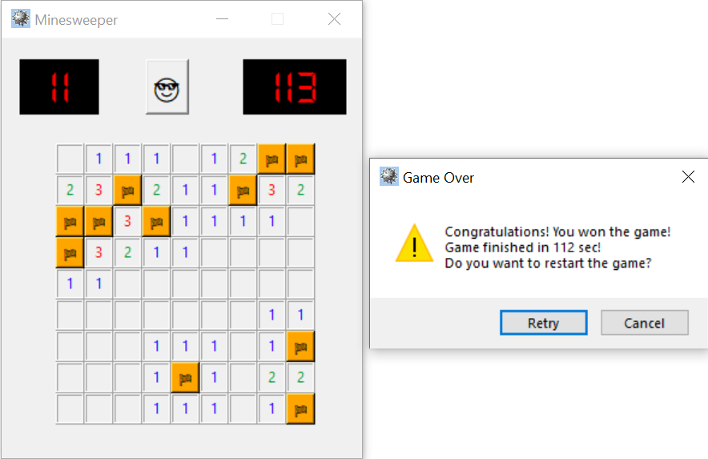
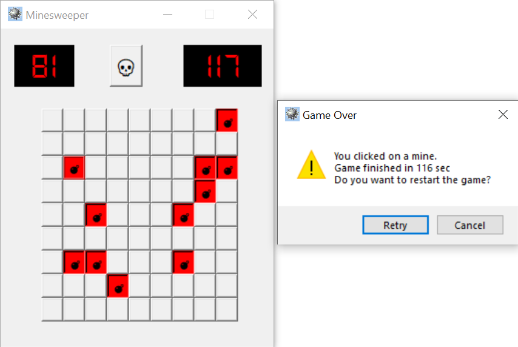

<div id="top"></div>
<!-- PROJECT SHIELDS -->
<div align="center">
  
  [![Contributors][contributors-shield]][contributors-url]
  [![Forks][forks-shield]][forks-url]
  [![Stargazers][stars-shield]][stars-url]
  [![Issues][issues-shield]][issues-url]
</div>

<!-- PROJECT LOGO -->
<br />
<div align="center">
  
  ![game_in_progress]

  <h2 align="center">Minesweeper Game</h2>

  <p align="center">
    Minesweeper game implementation with Python and Tkinter
    <br />
    <a href="https://github.com/Bunnicz/MineSweeper"><strong>Explore the docs »</strong></a>
    <br />
    <a href="https://github.com/Bunnicz/MineSweeper/issues">Report Bug</a>
  </p>
</div>


<!-- TABLE OF CONTENTS -->
<details>
  <summary>Table of Contents</summary>
  <ol>
    <li><a href="#disclaimer">Disclaimer</a></li>
    <li><a href="#about-the-project">About The Project</a></li>
    <li><a href="#requirements">Requirements</a></li>
    <li><a href="#how-to-play">How To Play</a></li>
    <li><a href="#screenshots">Screenshots</a></li>
    <li><a href="#contact">Contact</a></li>
  </ol>
</details>


<!-- DISCLAIMER -->
## Disclaimer
Project is based on youtube tuturial (Python Game Development Project Using OOP – Minesweeper Tutorial (w/ Tkinter)) by freeCodeCamp.org

<p align="right">(<a href="#top">back to top</a>)</p>


<!-- ABOUT THE PROJECT -->
## About The Project
<div align="center">
  
  ![game_init]
  
</div>

This repository contains Minesweeper game implementation with Python and Tkinter. Code included may be not perfect, if you find an error/bug in the code you can report it as an issue or pull request to fix the code. Thanks

Minesweeper is a game where mines are hidden in a grid of squares. Safe squares have numbers telling you how many mines touch the square. You can use the number clues to solve the game by opening all of the safe squares. If you click on a mine you lose the game!

<p align="right">(<a href="#top">back to top</a>)</p>


<!-- REQUIREMENTS -->
## Requirements
To run the game simply install required packages from ```requirements.txt``` on your local python or virtual enviorment:

```
pip install requirements.txt
```

If you have 'venv' module installed you can settup virtual enviorment with:

- Windows cmd:
```
python -m venv venv
```
and run venv with:
```
venv\Scripts\activate.bat
```

- Bash:
```
python -m venv venv
```
and run venv with:
```
source venv/Scripts/activate
```

<p align="right">(<a href="#top">back to top</a>)</p>


<!-- HOW TO PLAY -->
## How To Play

You open squares with the left mouse button and put flags on mines with the right mouse button. Pressing the right mouse button again changes your flag into a questionmark. When you open a square that does not touch any mines, it will be empty and the adjacent squares will automatically open in all directions until reaching squares that contain numbers. A common strategy for starting games is to randomly click until you get a big opening with lots of numbers.

Difficulty level is Beginner (9x9 with 11 mines). If you wish you can adjust the difficulty level in ```settings.py```. Note if you change number of cells it is required to also adjust resolution of window to fit all of the cells.

If you end game, either by clicking on the mine or discovering all of the empty cells proper message box will apear (see screenshots section) with ability to restart the game.
You can also restart the game by left clicking the face emoji button!

<p align="right">(<a href="#top">back to top</a>)</p>


<!-- SCREENSHOTS -->
## Screenshots

#### When you win the game:
<br />
<div align="center">
  
 </div>
 
#### When you click on the mine:
<br />
<div align="center">
  
</div>

<p align="right">(<a href="#top">back to top</a>)</p>

<!-- CONTACT -->
## Contact

Kamil - kpodgorski367@gmail.com

Project Link: [https://github.com/Bunnicz/MineSweeper](https://github.com/Bunnicz/MineSweeper)

<p align="right">(<a href="#top">back to top</a>)</p>


<!-- MARKDOWN LINKS & IMAGES -->
<!-- https://www.markdownguide.org/basic-syntax/#reference-style-links -->
[contributors-shield]: https://img.shields.io/github/contributors/Bunnicz/MineSweeper.svg?style=for-the-badge
[contributors-url]: https://github.com/Bunnicz/MineSweeper/graphs/contributors
[forks-shield]: https://img.shields.io/github/forks/Bunnicz/MineSweeper.svg?style=for-the-badge
[forks-url]: https://github.com/Bunnicz/MineSweeper/network/members
[stars-shield]: https://img.shields.io/github/stars/Bunnicz/MineSweeper.svg?style=for-the-badge
[stars-url]: https://github.com/Bunnicz/MineSweeper/stargazers
[issues-shield]: https://img.shields.io/github/issues/Bunnicz/MineSweeper.svg?style=for-the-badge
[issues-url]: https://github.com/Bunnicz/MineSweeper/issues

[game_init]: screenshots/game_init.png "Game start up"
[game_in_progress]: screenshots/game_in_progress.png "Gameplay"
[game_over]: screenshots/game_over.png "Gameover"
[game_won]: screenshots/game_won.png "Game won"
